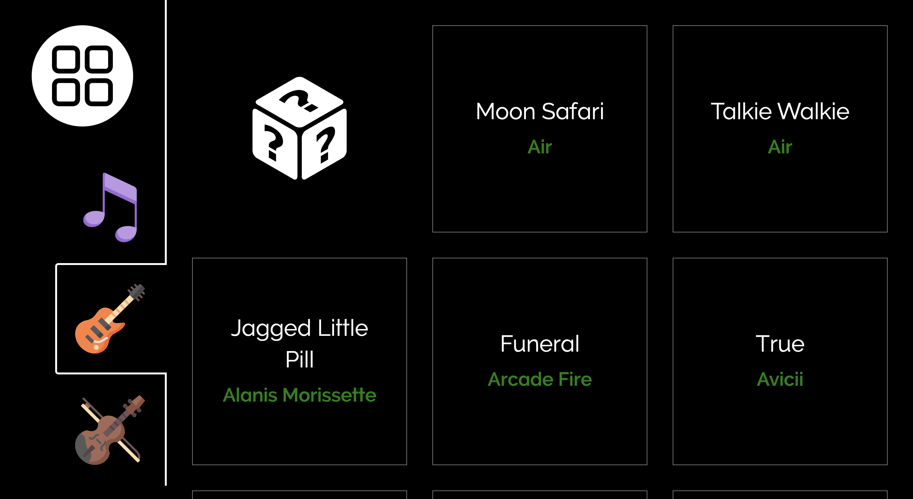
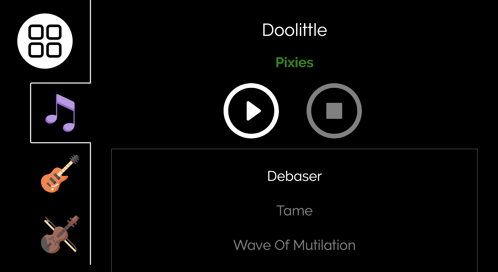
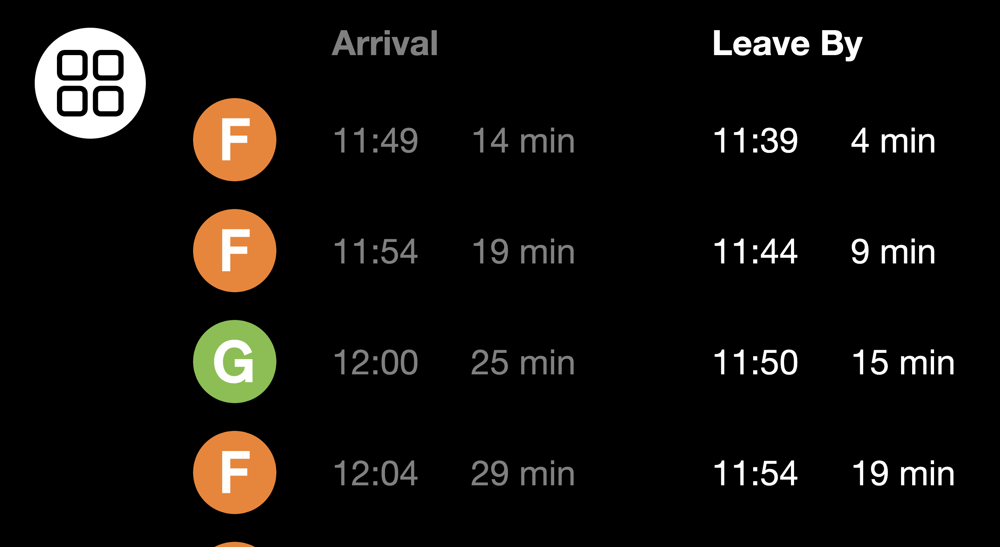

# Home

If you're like me, you enjoy listening to music when you're cooking or cleaning.

But this isn't as easy as it sounds. There are many steps that must be taken in order to make this happen:

1. Find your phone
2. Connect your phone to your home sound system
3. Unlock your phone
4. Open your music app
5. Find the album you want and play it

Ugh. Think of the opportunity cost. I needed a better way.

"Home" is a Flask app running on a Raspberry Pi attached to the wall. The Pi is connected to a touch screen. The app is always running, so it's always ready to play music at the touch of a button.

The app uses [OMXPlayer](https://www.raspberrypi.org/documentation/raspbian/applications/omxplayer.md) to play the music files. The process ID is stored in Redis, so it can be killed later if a different song is selected.

### Album Select Screen

Touch the album you want, or the question box for a random choice.

### Play Screen

Use this screen to see what song is playing. Touch a different song to change the track, or the stop button to stop playing.

### NYC Subway

The app is also wired up to the New York City subway API, so I can see when trains are arriving at the stations close to my home.

