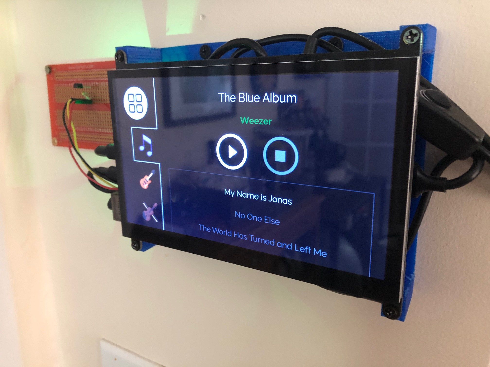
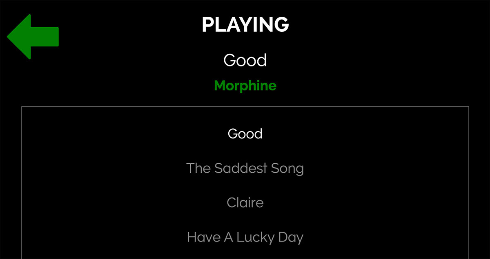

# Jarvis

If you're like me, you enjoy listening to music when you're cooking or cleaning.

But this isn't as easy as it sounds. There are many steps that must be taken in order to make this happen:

1. Find your phone
2. Connect your phone to your home sound system
3. Unlock your phone
4. Open your music app
5. Find the album you want and play it

Ugh. Performing the above steps must add up to several days per year of lost time. Think of the opportunity cost. I needed a better way.

Well now I have one. Behold Jarvis:

Jarvis is a Flask app running on a Raspberry Pi, which is attached to the wall of my kitchen. The Pi is connected to a touch screen, and also to an external drive containing all of my music files. The app is always running, so it's always ready to play music at the touch of a button.

The app uses [OMXPlayer](https://www.raspberrypi.org/documentation/raspbian/applications/omxplayer.md) to play the music files. The process ID is stored in Redis, so it can be killed later if a different song is selected.

### Album Select Screen

Just click the album you want. Want to be surprised? Touch the question box icon for a random choice.

### Play Screen

You can skip around the album if desired by touching songs. Touch the green arrow to go back.

